# Lab 11: Build and Deploy a Project Management Assistant with the Microsoft Teams SDK

**Duration:** 50 minutes

# Lab scenario

**Zava Retail** is a retail company with stores and digital commerce
operations, supported by technology teams that manage multiple business
and customer-facing projects. **Maya Kapoor, a Project Manager at Zava
Retail,** manages several projects and needs to stay informed about
project progress, risks, priorities, upcoming meetings, and stakeholder
updates.

To help project teams work more efficiently, **Christine Parker, CTO**
at Zava Retail, has asked the technology team to introduce a
project-management assistant directly in Microsoft Teams**,** where
teams already collaborate, hold meetings, and share project updates.
Using the **Microsoft Teams SDK**, you will build a **Zava Project
Status Assistant** that can support multiple projects and help users
quickly access project information and take action from within Teams.
For this lab, **Project Phoenix** is used as an example project with an
**At Risk** status, a customer review scheduled for **tomorrow**,
**three open issues**, and **two remaining deployment tasks**. You will
build the assistant using Python, run it locally, expose it through a
**Microsoft Dev Tunnel**, register it using the **Teams Developer CLI**,
and interact with it directly in Microsoft Teams.

## Key persona

**Maya Kapoor — Project Manager, Zava Retail**

Manages multiple projects and uses the **Zava Project Status Assistant**
to quickly check project status, priorities, meeting preparation, and
project updates.

## Objectives

By the end of this lab, you will be able to:

1.  Create a **Python Teams SDK** application.

2.  Build a **project-focused assistant** that can work with multiple
    Zava Retail projects.

3.  Run the assistant locally and expose it through a **Microsoft Dev
    Tunnel**.

4.  Register and deploy the application to **Microsoft Teams** using the
    Teams Developer CLI.

5.  Retrieve project status, priorities, and meeting preparation
    information directly in Teams.

6.  Generate and interact with a **project update using an Adaptive
    Card**.

## Exercise 1 - Create the Teams SDK project

In this exercise, you create the foundation for the **Zava Project
Status Assistant** using the **Microsoft Teams SDK for Python**. You
also create a Python virtual environment and install the dependencies
required to run the application.

**What is the Teams SDK?**

Teams SDK is a suite of packages for building agents and applications on
Microsoft Teams. It handles authentication, event routing, and
Teams-specific plumbing so you can focus on your app's logic. Using
this, you can create  AI-powered agents, message extensions, embedded
web apps, Adaptive Cards, dialogs, Microsoft Graph integrations, and
more across TypeScript, C#, and Python.

### Task 1 - Create a project

1.  Open Command Prompt and login into teams using the following
    command:

    +++teams login+++

    If the above command gives an error then you can use the following
    command:

    +++teams login --device-code+++

    

2.  Open the link in your web browser, then enter the code. Select the
    current username to log in.

    

    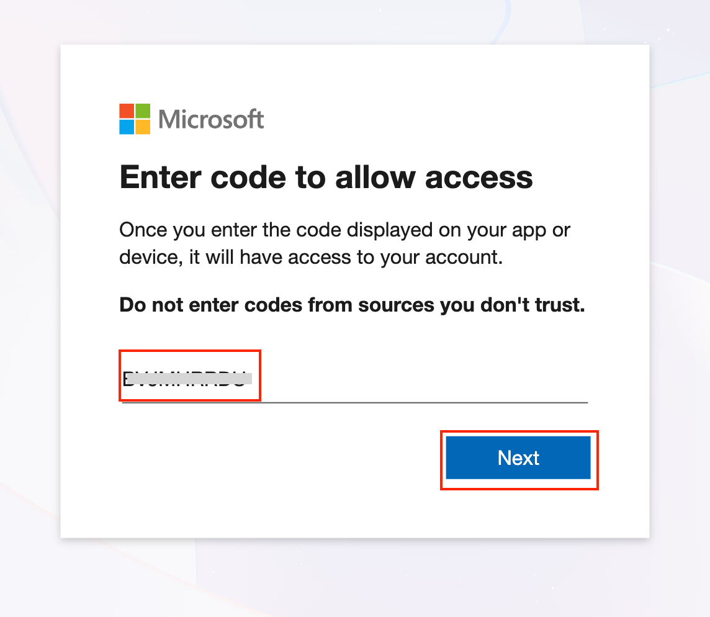

    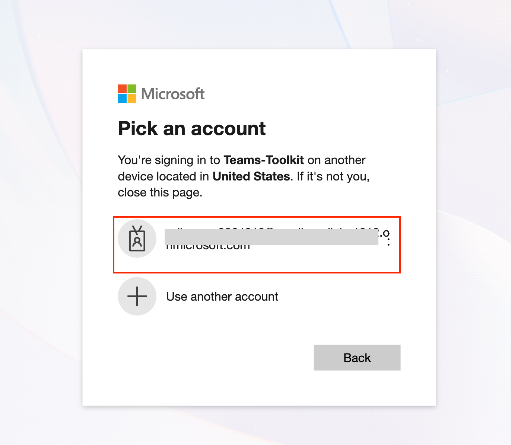

3.  Click **Continue,** and after that close the window.

    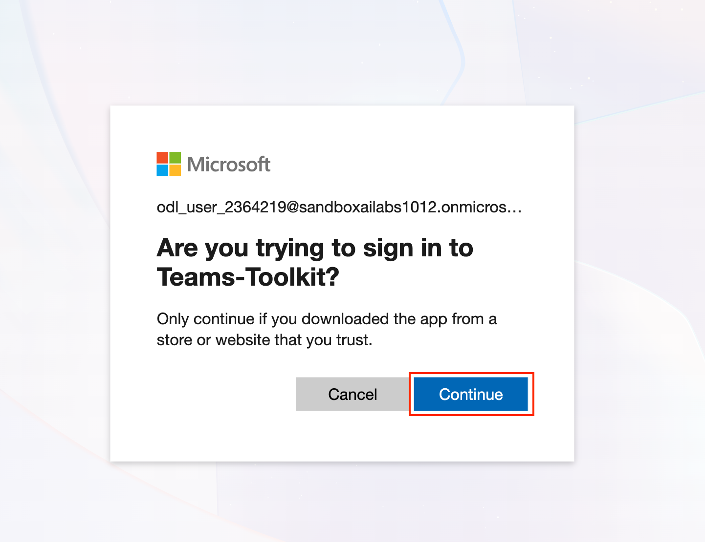
    
    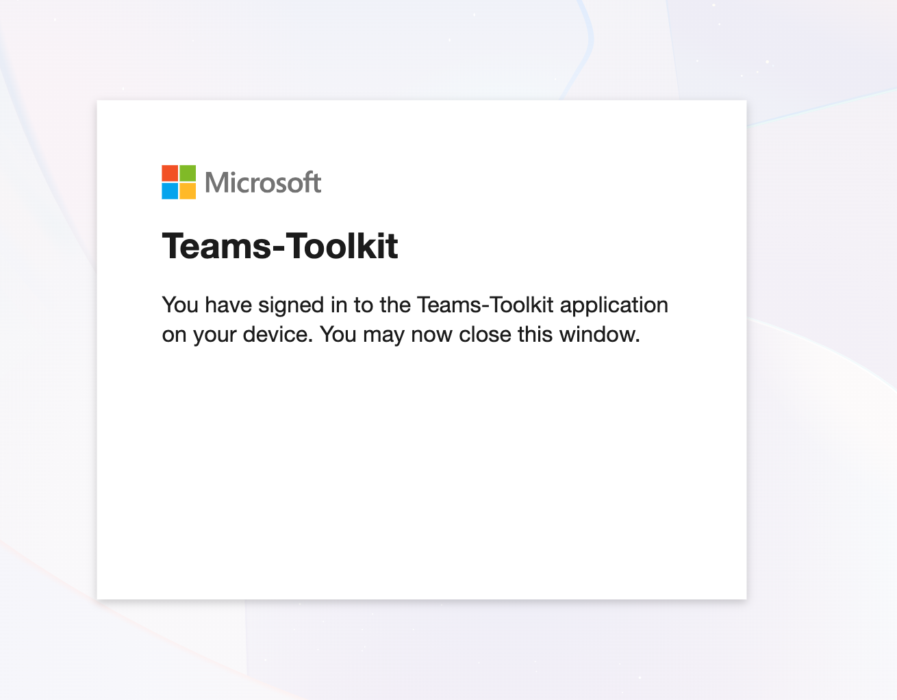

4.  Run the following command to log in to Azure.

    +++az login+++

5.  Check the status of the Teams login. Make sure it shows Sideloading:
    enabled.

    +++teams status+++

    

6.  After successfully logging in, create a new project using the
    following command:

    +++teams project new python project-assistant --template echo+++

7.  Enter +++Y+++ and hit Enter. This confirms you want to scaffold a new Python-based Teams app named project-assistant using the echo template.


8.  Move into the project:

    +++cd project-assistant+++

### Task 2 – Install dependencies

1.  Create and activate a virtual environment:

    +++python -m venv .venv+++

    +++.venv\Scripts\activate+++

    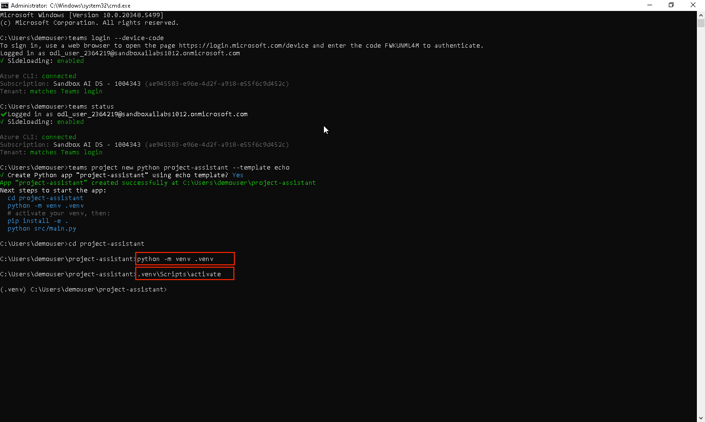

2.  Install all the dependencies using the following command:

    +++pip install -e .+++

    

## Exercise 2 — Build the Project Assistant

In this exercise, you will transform the starter Teams SDK echo
application into a business-focused project assistant for Project
Phoenix. You will add project data and message-handling logic to provide
status updates, priorities, and meeting preparation.

### Task 1: Create the Project Assistant agent in Teams SDK

1.  Open Visual Studio Code and open the **project-assistant** folder from
    C:\demouser
    
    

2.  Navigate to .\src\main.py and replace the current content with the
    following code:
    ```
    from microsoft_teams.apps import App, ActivityContext
    from microsoft_teams.api import MessageActivity
    
    # ---------------------------------------------------------
    # Create Teams application
    # ---------------------------------------------------------
    app = App(skip_auth=True)
    
    
    # ---------------------------------------------------------
    # Project Phoenix sample data
    # ---------------------------------------------------------
    PROJECT = {
        "name": "Project Phoenix",
        "owner": "Priya Nair",
        "status": "At Risk",
        "customer_review": "Tomorrow",
        "open_issues": 3,
        "deployment_tasks": 2,
        "next_milestone": "Production deployment",
    }
    
    # ---------------------------------------------------------
    # Project status
    # ---------------------------------------------------------
    def project_status():
        return f"""
    **Project Phoenix — Current Status**
    
    **Overall status:** {PROJECT["status"]}
    
    **Project owner:** {PROJECT["owner"]}
    
    **Customer review:** {PROJECT["customer_review"]}
    
    **Open issues:** {PROJECT["open_issues"]}
    
    **Deployment tasks remaining:** {PROJECT["deployment_tasks"]}
    
    **Next milestone:** {PROJECT["next_milestone"]}
    
    **Recommended priority:**
    Complete the remaining deployment tasks before the customer review.
    """
    
    # ---------------------------------------------------------
    # Meeting preparation
    # ---------------------------------------------------------
    def meeting_preparation():
        return """
    **Phoenix Project Meeting Preparation**
    
    **Meeting purpose**
    
    Review customer-release readiness for Project Phoenix.
    
    **Key discussion topics**
    
    • Deployment readiness
    • Open issues
    • Customer review preparation
    • Production deployment
    
    **Open decisions**
    
    • Confirm owners for the remaining deployment tasks.
    • Confirm that critical issues are resolved.
    • Confirm readiness of the customer review package.
    
    **Questions to raise**
    
    1. Are all remaining deployment tasks assigned?
    2. Are the three open issues being actively tracked?
    3. Is the customer review package ready?
    4. Are there any risks that could affect production deployment?
    """
    
    # ---------------------------------------------------------
    # Today's priorities
    # ---------------------------------------------------------
    def priorities():
        return """
    **Today's Phoenix Priorities**
    
    1. Complete the remaining deployment tasks.
    2. Review the three open issues.
    3. Confirm customer-review readiness.
    4. Verify the production deployment checklist.
    
    **Why this matters**
    
    The customer review is tomorrow, so deployment readiness is currently
    the highest priority.
    """
    
    # ---------------------------------------------------------
    # Normal Teams message handler
    # ---------------------------------------------------------
    @app.on_message
    async def handle_message(ctx: ActivityContext[MessageActivity]):
        text = (ctx.activity.text or "").lower().strip()
    
        print(f"[USER] {ctx.activity.text}")
    
        if (
            "status" in text
            or "project status" in text
            or "how is phoenix" in text
        ):
            await ctx.send(project_status())
            return
    
        if (
            "meeting" in text
            or "prepare me" in text
            or "meeting preparation" in text
        ):
            await ctx.send(meeting_preparation())
            return
    
        if (
            "priority" in text
            or "priorities" in text
            or "what should i focus" in text
            or "what should i do" in text
        ):
            await ctx.send(priorities())
            return
    
        await ctx.send(
            "I can help with Project Phoenix.\n\n"
            "Try:\n"
            "• What is the current status of Project Phoenix?\n"
            "• Prepare me for my Phoenix project meeting.\n"
            "• What should I focus on today?"
        )
    
    # ---------------------------------------------------------
    # Start application
    # ---------------------------------------------------------
    if __name__ == "__main__":
        import asyncio
    
        asyncio.run(app.start())
    ```

    Note: **skip_auth=True** is intended for local unauthenticated
    Playground testing, not the Teams channel. So when we move the agent
    to production, we should remove this.

    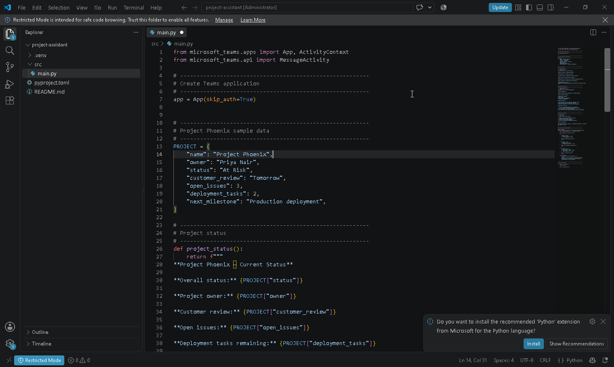

## Exercise 3 — Understand the Project Assistant Code(Read Only)

Now that you have created the Project Assistant, let's review its
structure and key components. Understanding how these components work
together will help you extend the assistant with additional
capabilities.

1.  **Project Structure**

    The Project Assistant uses a simple project structure:

    project-assistant/

    ├── src

    └── main.py \# Main application code

    src/: Contains the application source code.

    main.py: The entry point of the application. It defines the project
    information, response functions, message handling, and application
    startup.

2.  **The App Class**

    The heart of an application is the App class. This class handles all
    incoming activities and manages the application's lifecycle. It also
    acts as a way to host your application service.

    ```
    from microsoft_teams.apps import App, ActivityContext
    from microsoft_teams.api import MessageActivity

    app = App()

    ```

    The app configuration includes a variety of options that allow you to
    customize its behavior, including controlling the underlying server,
    authentication, and other settings.

    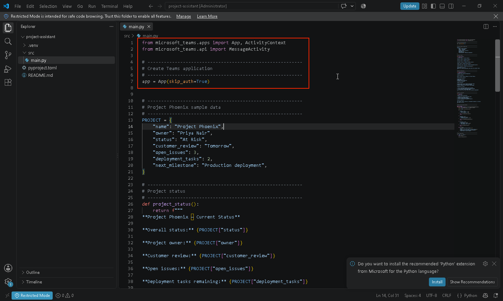

3.  **Project Information**

    The assistant needs information about Project Phoenix to provide
    useful responses. This information is stored in a Python dictionary.
    ```
    PROJECT = {
        "name": "Project Phoenix",
        "owner": "Priya Nair",
        "status": "At Risk",
        "customer_review": "Tomorrow",
        "open_issues": 3,
        "deployment_tasks": 2,
        "next_milestone": "Production deployment",
    }

    ```
    Each key represents a piece of project information that can be used by
    the assistant when generating responses. This approach also makes it
    easy to update the project details without changing the
    message-handling logic.

    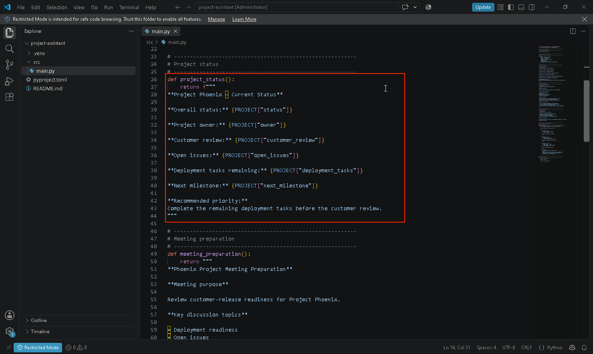

4.  **Response Functions**

    The assistant uses separate Python functions to generate responses for
    different types of requests.

    For example:
    ```
    def project_status():
        return f"""
        **Project Phoenix — Current Status**

        **Overall status:** {PROJECT["status"]}
        **Project owner:** {PROJECT["owner"]}
        **Customer review:** {PROJECT["customer_review"]}
        """

    ```

    The application also includes functions for meeting preparation and
    daily priorities:

    - project_status() — Provides the current project status.

    - meeting_preparation() — Provides information to help prepare for a
    project meeting.

    - priorities() — Provides the recommended project priorities.

    Separating these functions keeps the response logic organized and
    makes the application easier to extend.

    

5.  **Message Handling**

    Teams applications can respond to different types of activities. In
    this application, the assistant responds to incoming messages using
    the @app.on_message handler.

    ```
    @app.on_message
    async def handle_message(ctx: ActivityContext[MessageActivity]):
        text = (ctx.activity.text or "").lower().strip()
    ```

    The handler receives the incoming message through the ActivityContext and reads the text sent by the user.
    The application then checks the message to determine what information the user is requesting.
    For example:

    ```
    if "status" in text:
        await ctx.send(project_status())
        return
    ```

    When a user asks about the project status, the application calls
    project_status() and sends the result back to the user.

    The same approach is used to handle meeting preparation and
    priority-related questions.

    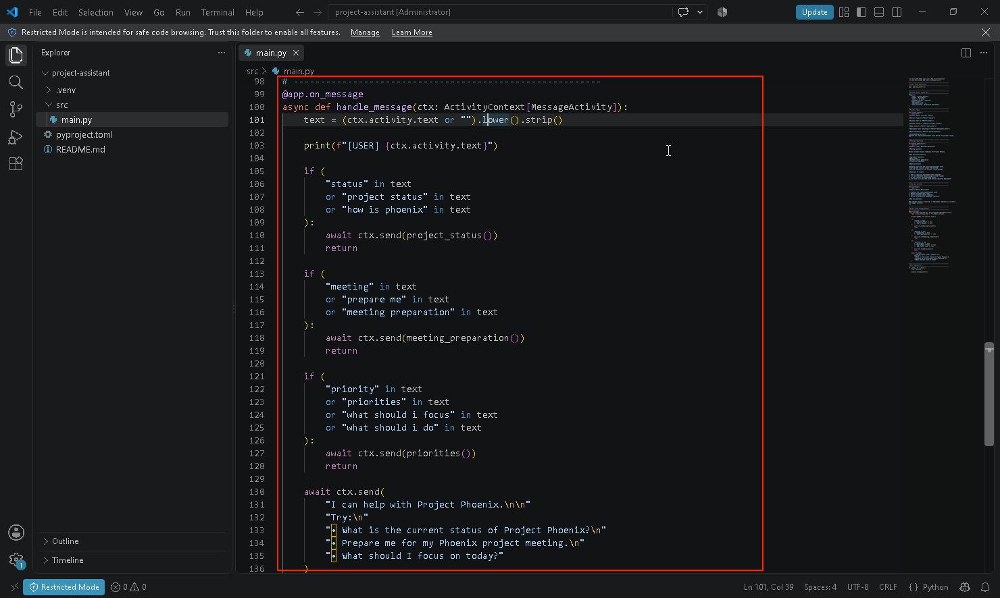

6.  **Sending Responses**

    The ctx.send() method sends a message from the assistant back to the
    user in Teams.

    ```
    await ctx.send(project_status())
    ```

    In this example, the project_status() function generates the response
    and ctx.send() delivers it to the Teams conversation.

7.  **Fallback Response**

    Not every user message will match the conditions defined in the
    application. When no matching keyword is found, the assistant provides
    examples of questions that it can handle.
    ```
    await ctx.send(
        "I can help with Project Phoenix.\n\n"
        "Try:\n"
        "• What is the current status of Project Phoenix?\n"
        "• Prepare me for my Phoenix project meeting.\n"
        "• What should I focus on today?"
    )

    ```
    This gives the user guidance instead of leaving the message
    unanswered.

    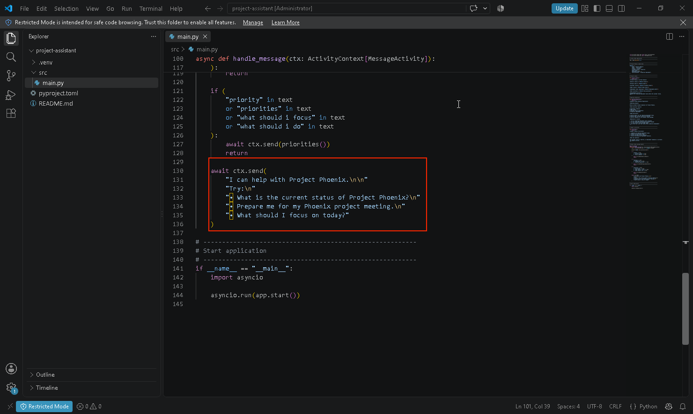

8.  **Application Lifecycle**

    The application starts when main.py is executed.

    ```
    if __name__ == "__main__":
        import asyncio
        asyncio.run(app.start())

    ```
    This code initializes your application server and, when configured for
    Teams, also authenticates it to be ready for sending and receiving
    messages.

    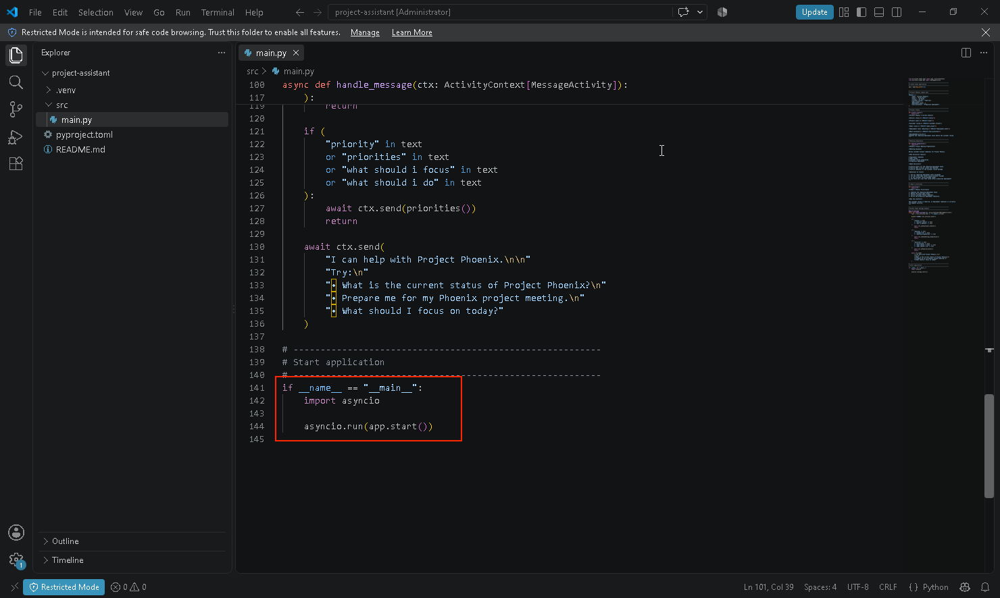

## Exercise 4 — Run the agent locally

In this exercise, you start the Python application and verify its
message-handling logic before connecting it to Microsoft Teams. Testing
locally first helps you catch code or dependency issues before you
introduce the Dev Tunnel and Teams registration steps.

1.  Navigate back to the command prompt and start the development server
    using the following command.

    +++python .\src\main.py+++

    Note: Keep this window running; do not close this window.

    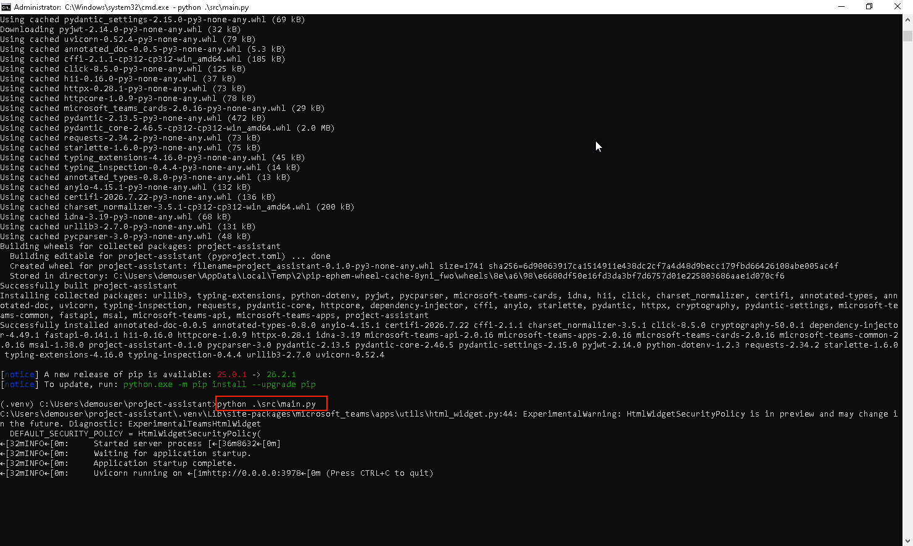

2.  In the console, you should see a similar output:

    The HTTP server is now listening on port 3978.

3.  Now open a new command prompt. Test your agent locally without
    sideloading it into Teams, using the Microsoft 365 Agents
    Playground. So run the following command in the command prompt to
    open the M365 Agent Playground:

    +++agentsplayground -e http://localhost:3978/api/messages -c
    emulator+++

    

4.  Enter the following prompts:

    Prompt 1: +++Hello+++

    

    

    Prompt 2: +++ What is the current status of Project Phoenix?+++

    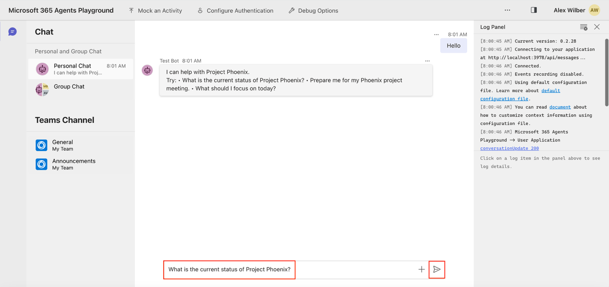

    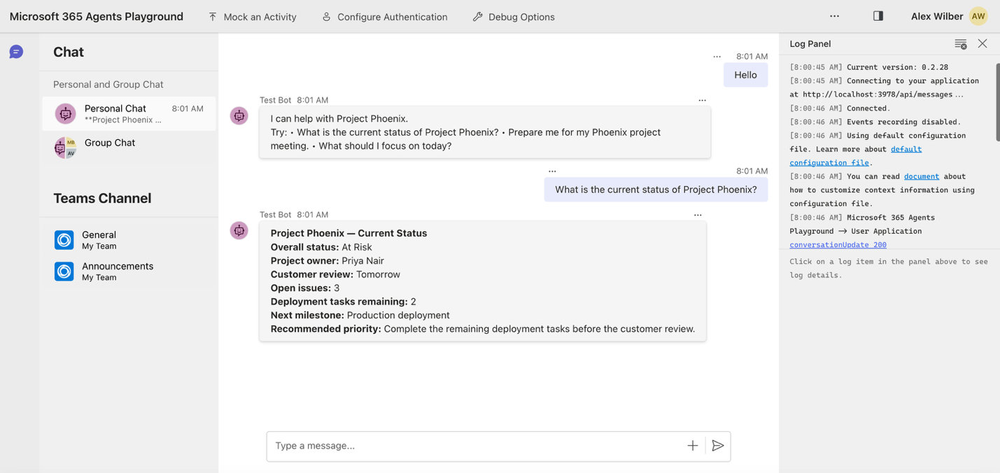

5.  Close the window to end the M365 playground, and press CTRL + C in
    both windows to end the current process.

## Exercise 5 - Add the Adaptive Card

In this exercise, you extend the project assistant with an interactive
Adaptive Card. The card presents a project update in a structured format
and lets the user choose whether to send or cancel the update. This
introduces a practical Teams interaction beyond plain text messages.

### Task 1 - Adding the Adaptive Card to the agent

1.  Open VS code again and open main.py file.

2.  Replace the existing import section at the very top of main.py with
    this:

    ```
    from microsoft_teams.apps import App, ActivityContext
    from microsoft_teams.api import (
        MessageActivity,
        AdaptiveCardInvokeActivity,
        AdaptiveCardActionMessageResponse,
        InvokeResponse,
    )
    from microsoft_teams.cards import AdaptiveCard, TextBlock, ExecuteAction
    
    ```

    This adds the Teams SDK classes required to create an Adaptive Card
    and handle button actions.

    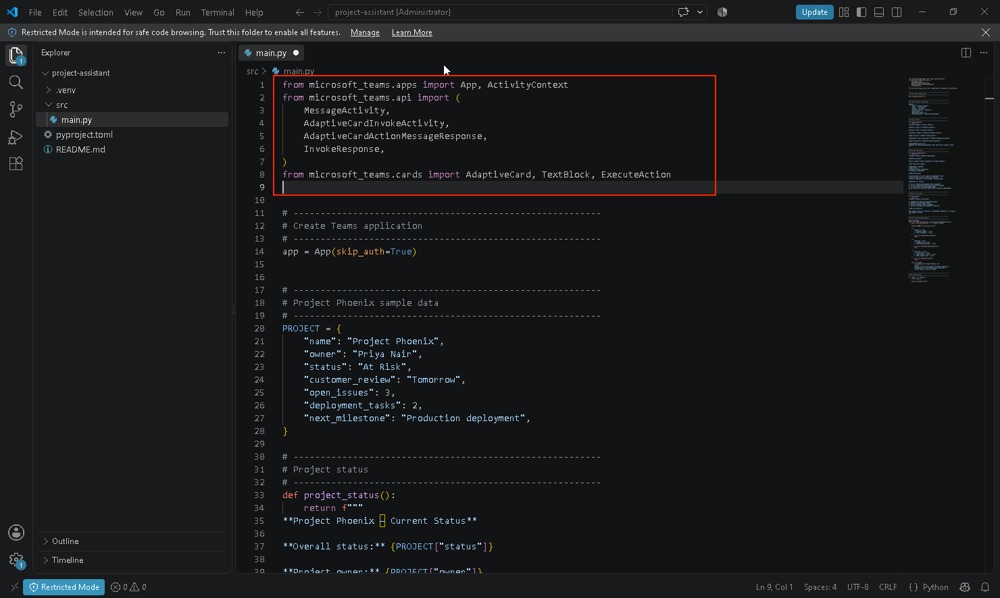

3.  Add this entire block after the priorities() function and before
    @app.on_message:

    ```
    # ---------------------------------------------------------
    # Adaptive Card
    # ---------------------------------------------------------
    
    def project_update_card():
    
        return AdaptiveCard(
            version="1.5",
    
            body=[
                TextBlock(
                    text="Project Phoenix — Team Update",
                    weight="Bolder",
                    size="Large",
                    wrap=True,
                ),
    
                TextBlock(
                    text="Status: AT RISK",
                    weight="Bolder",
                    wrap=True,
                ),
    
                TextBlock(
                    text=(
                        "Customer review: Tomorrow\n"
                        "Open issues: 3\n"
                        "Deployment tasks remaining: 2\n"
                        "Next milestone: Production deployment"
                    ),
                    wrap=True,
                ),
    
                TextBlock(
                    text=(
                        "Priority: Complete the remaining deployment "
                        "tasks before the customer review."
                    ),
                    wrap=True,
                ),
            ],
    
            actions=[
                ExecuteAction(
                    title="Send Update",
                    verb="send_update",
                    data={
                        "action": "send_update"
                    },
                ),
    
                ExecuteAction(
                    title="Cancel",
                    verb="cancel_update",
                    data={
                        "action": "cancel_update"
                    },
                ),
            ],
        )

    ```

    This creates an Adaptive Card containing the current Phoenix project
    status and two interactive buttons: **Send Update** and **Cancel**.

    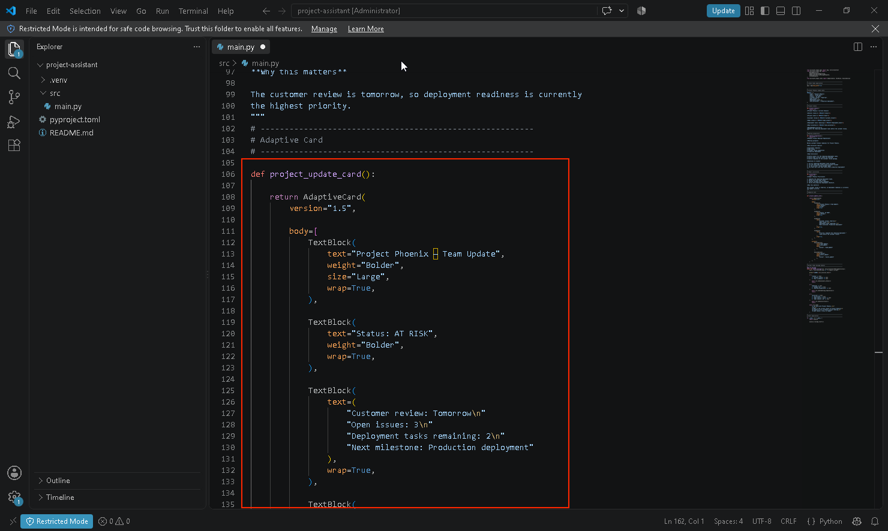

4.  Inside handle_message(), add this after the existing Priorities
    condition and before the Default response.

    ```
    # Adaptive Card
        if (
            "project update" in text
            or "draft an update" in text
            or "draft a project update" in text
        ):
            await ctx.send(project_update_card())
            return

    ```
    This connects a learner's message such as **"Draft a project update"**
    to the Adaptive Card

    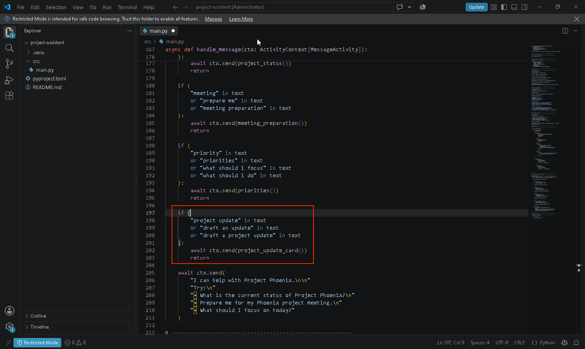

5.  Add the following adaptive card action handler before the main()
    function.

    ```
    # ---------------------------------------------------------
    # Adaptive Card action handler
    # ---------------------------------------------------------
     
    @app.on_card_action
    async def handle_card_action(
        ctx: ActivityContext[AdaptiveCardInvokeActivity],
    ) -> InvokeResponse[AdaptiveCardActionMessageResponse]:
     
        action = ctx.activity.value.action
     
        data = action.data or {}
     
        action_name = data.get("action")
     
        print(f"[CARD ACTION] {action_name}")
     
        # -----------------------------------------------------
        # Send Update
        # -----------------------------------------------------
     
        if action_name == "send_update":
     
            return InvokeResponse(
                status=200,
                body=AdaptiveCardActionMessageResponse(
                    value=(
                        "✅ **Project update sent successfully.**\n\n"
                        "The Project Phoenix team has been notified "
                        "of the current project status."
                    )
                ),
            )
     
        # -----------------------------------------------------
        # Cancel
        # -----------------------------------------------------
     
        if action_name == "cancel_update":
     
            return InvokeResponse(
                status=200,
                body=AdaptiveCardActionMessageResponse(
                    value=(
                        "❌ **Project update cancelled.**\n\n"
                        "No update was sent to the Project Phoenix team."
                    )
                ),
            )
     
        # -----------------------------------------------------
        # Unknown action
        # -----------------------------------------------------
     
        return InvokeResponse(
            status=200,
            body=AdaptiveCardActionMessageResponse(
                value="⚠️ Unknown card action."
            ),
        )
        ```

    This handler processes the learner’s button selection and returns an appropriate response when they choose Send Update or Cancel.
    
6. Save the file using CTRL+S.
7.	So the file main.py file will look like this:

    ```
    from microsoft_teams.apps import App, ActivityContext
    from microsoft_teams.api import (
        MessageActivity,
        AdaptiveCardInvokeActivity,
        AdaptiveCardActionMessageResponse,
        InvokeResponse,
    )
    from microsoft_teams.cards import AdaptiveCard, TextBlock, ExecuteAction


    # ---------------------------------------------------------
    # Create Teams application
    # ---------------------------------------------------------

    app = App()


    # ---------------------------------------------------------
    # Project Phoenix sample data
    # ---------------------------------------------------------

    PROJECT = {
        "name": "Project Phoenix",
        "owner": "Priya Nair",
        "status": "At Risk",
        "customer_review": "Tomorrow",
        "open_issues": 3,
        "deployment_tasks": 2,
        "next_milestone": "Production deployment",
    }


    # ---------------------------------------------------------
    # Project status
    # ---------------------------------------------------------

    def project_status():
        return f"""
    **Project Phoenix — Current Status**

    **Overall status:** {PROJECT["status"]}

    **Project owner:** {PROJECT["owner"]}

    **Customer review:** {PROJECT["customer_review"]}

    **Open issues:** {PROJECT["open_issues"]}

    **Deployment tasks remaining:** {PROJECT["deployment_tasks"]}

    **Next milestone:** {PROJECT["next_milestone"]}

    **Recommended priority:**

    Complete the remaining deployment tasks before the customer review.
    """


    # ---------------------------------------------------------
    # Meeting preparation
    # ---------------------------------------------------------

    def meeting_preparation():
        return """
    **Phoenix Project Meeting Preparation**

    **Meeting purpose**

    Review customer-release readiness for Project Phoenix.

    **Key discussion topics**

    • Deployment readiness
    • Open issues
    • Customer review preparation
    • Production deployment

    **Open decisions**

    • Confirm owners for the remaining deployment tasks.
    • Confirm that critical issues are resolved.
    • Confirm readiness of the customer review package.

    **Questions to raise**

    1. Are all remaining deployment tasks assigned?
    2. Are the three open issues being actively tracked?
    3. Is the customer review package ready?
    4. Are there any risks that could affect production deployment?
    """


    # ---------------------------------------------------------
    # Today's priorities
    # ---------------------------------------------------------

    def priorities():
        return """
    **Today's Phoenix Priorities**

    1. Complete the remaining deployment tasks.
    2. Review the three open issues.
    3. Confirm customer-review readiness.
    4. Verify the production deployment checklist.

    **Why this matters**

    The customer review is tomorrow, so deployment readiness is currently
    the highest priority.
    """


    # ---------------------------------------------------------
    # Adaptive Card
    # ---------------------------------------------------------

    def project_update_card():

        return AdaptiveCard(
            version="1.5",

            body=[
                TextBlock(
                    text="Project Phoenix — Team Update",
                    weight="Bolder",
                    size="Large",
                    wrap=True,
                ),

                TextBlock(
                    text="Status: AT RISK",
                    weight="Bolder",
                    wrap=True,
                ),

                TextBlock(
                    text=(
                        "Customer review: Tomorrow\n"
                        "Open issues: 3\n"
                        "Deployment tasks remaining: 2\n"
                        "Next milestone: Production deployment"
                    ),
                    wrap=True,
                ),

                TextBlock(
                    text=(
                        "Priority: Complete the remaining deployment "
                        "tasks before the customer review."
                    ),
                    wrap=True,
                ),
            ],

            actions=[
                ExecuteAction(
                    title="Send Update",
                    verb="send_update",
                    data={
                        "action": "send_update"
                    },
                ),

                ExecuteAction(
                    title="Cancel",
                    verb="cancel_update",
                    data={
                        "action": "cancel_update"
                    },
                ),
            ],
        )


    # ---------------------------------------------------------
    # Normal Teams message handler
    # ---------------------------------------------------------

    @app.on_message
    async def handle_message(
        ctx: ActivityContext[MessageActivity]
    ):

        text = (ctx.activity.text or "").lower().strip()

        print(f"[USER] {ctx.activity.text}")

        # Project status
        if (
            "status" in text
            or "project status" in text
            or "how is phoenix" in text
        ):
            await ctx.send(project_status())
            return

        # Meeting preparation
        if (
            "meeting" in text
            or "prepare me" in text
            or "meeting preparation" in text
        ):
            await ctx.send(meeting_preparation())
            return

        # Priorities
        if (
            "priority" in text
            or "priorities" in text
            or "what should i focus" in text
            or "what should i do" in text
        ):
            await ctx.send(priorities())
            return

        # Adaptive Card
        if (
            "project update" in text
            or "draft an update" in text
            or "draft a project update" in text
        ):
            await ctx.send(project_update_card())
            return

        # Default response
        await ctx.send(
            "I can help with Project Phoenix.\n\n"
            "Try:\n"
            "• What is the current status of Project Phoenix?\n"
            "• Prepare me for my Phoenix project meeting.\n"
            "• What should I focus on today?\n"
            "• Draft a project update."
        )


    # ---------------------------------------------------------
    # Adaptive Card action handler
    # ---------------------------------------------------------

    @app.on_card_action
    async def handle_card_action(
        ctx: ActivityContext[AdaptiveCardInvokeActivity],
    ) -> InvokeResponse[AdaptiveCardActionMessageResponse]:

        action = ctx.activity.value.action

        data = action.data or {}

        action_name = data.get("action")

        print(f"[CARD ACTION] {action_name}")

        # -----------------------------------------------------
        # Send Update
        # -----------------------------------------------------

        if action_name == "send_update":

            return InvokeResponse(
                status=200,
                body=AdaptiveCardActionMessageResponse(
                    value=(
                        "✅ **Project update sent successfully.**\n\n"
                        "The Project Phoenix team has been notified "
                        "of the current project status."
                    )
                ),
            )

        # -----------------------------------------------------
        # Cancel
        # -----------------------------------------------------

        if action_name == "cancel_update":

            return InvokeResponse(
                status=200,
                body=AdaptiveCardActionMessageResponse(
                    value=(
                        "❌ **Project update cancelled.**\n\n"
                        "No update was sent to the Project Phoenix team."
                    )
                ),
            )

        # -----------------------------------------------------
        # Unknown action
        # -----------------------------------------------------

        return InvokeResponse(
            status=200,
            body=AdaptiveCardActionMessageResponse(
                value="⚠️ Unknown card action."
            ),
        )


    # ---------------------------------------------------------
    # Start application
    # ---------------------------------------------------------

    if __name__ == "__main__":
        import asyncio

        asyncio.run(app.start())

    ```

### Task 2 — Change the application from local Playground mode to Teams mode

1.  Open main.py file and look for the following line: app =
    App(skip_auth=True).

2.  Remove skip_auth=True because it is only used for unauthenticated
    local Playground testing not for real Teams deployment. Your App()
    class should look like this:
    ```
    app = App()
    ```
    This matters because the Dev Tunnel is public. It is recommended to
    remove this because a public tunnel exposes the local port and
    authentication should remain enabled for real channel testing.

    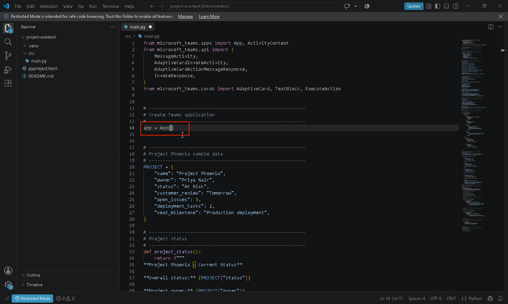

## Exercise 6 - Deploy the agent to the Teams

In this exercise, you make the assistant reachable from Microsoft Teams.
You will expose the local application through a Microsoft Dev Tunnel,
register the bot infrastructure with the Teams Developer CLI, and
install the app in Teams for end-to-end testing.

### Task 1 — Create the Microsoft Dev Tunnel

1.  Open a new command prompt and navigate to the current project
    folder.

    +++cd C:\Users\demouser\project-assistant+++

    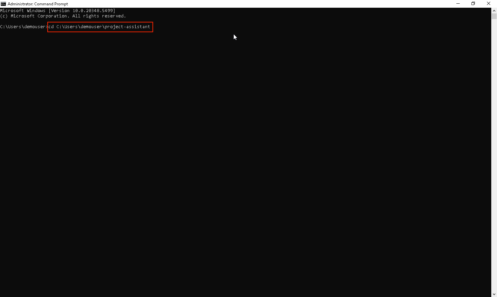

2.  Log in to the dev tunnel using the following command:

    +++devtunnel user login+++

    

3.  Select the current username and click **Continue**.

    

    

4.  Start the dev tunnel using the following command:

    +++devtunnel host -p 3978 --allow-anonymous+++

    Note: Do not close this window; keep it running.

    

5.  Save the dev tunnel link in Notepad; we will use it in the next
    task.

    

### Task 2 — Restart the Python agent

1.  Navigate back to the deployment server command prompt window and run
    the following command again:

    +++python .\src\main.py+++

    Keep this window running.

    

### Task 3 — Register and Install the Teams application

1.  Open a new command prompt and navigate to the project folder:

    +++cd C:\Users\demouser\project-assistant +++

    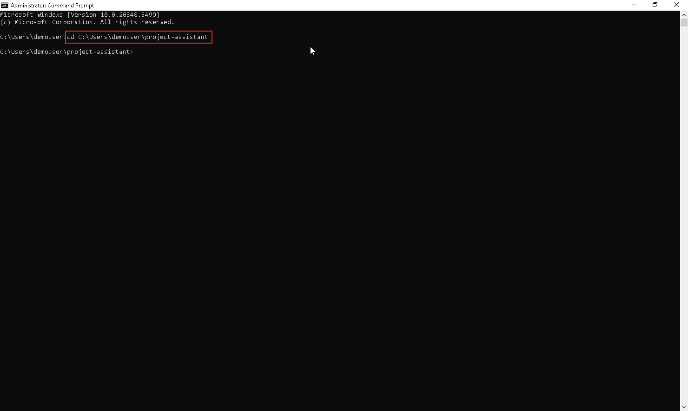

2.  Make sure your Python environment is activated:

    +++.venv\Scripts\activate+++

    

3.  To register the app. Replace the tunnel URL with **your actual
    URL**:

    +++teams app create --name Project-Assistant --endpoint https://<tunnel-host>/api/messages --env .env+++

    For example:

    teams app create --name Project-Assistant --endpoint https://c29q1k0t-3978XX.use2.devtunnels.ms/api/messages --env .env 

    Microsoft’s current registration quickstart uses `teams app create`
    with the public tunnel endpoint and `.env` for Python projects. The
    command creates/registers the bot infrastructure and prints the Teams
    App ID plus an **Install in Teams** link.

    

4.  Enter **y** to confirm the new application.

    

5.  Select **Install in Teams** to install the app in Microsoft Teams.

    Note: If you lost the Install in Teams link use the following command:

    +++teams app get <YOUR-TEAMS-APP-ID> --install-link+++

    

6.  Select **Use the Web app instead**.

    

7.  Click **Add**.

    

8.  Select Open.

    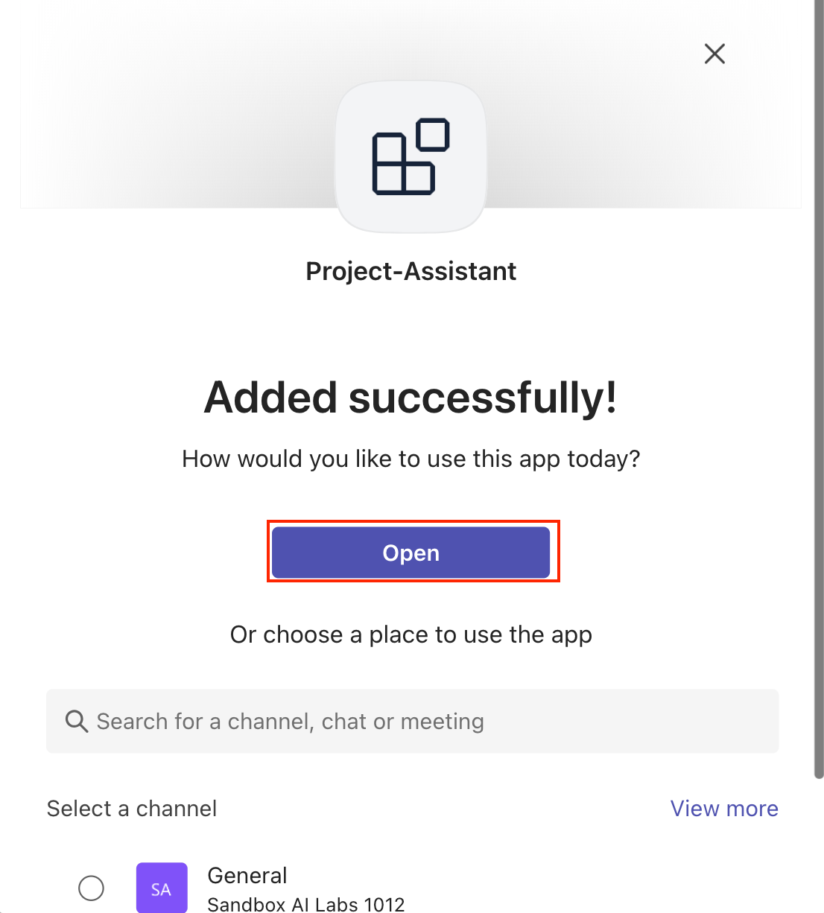

### Task 6 — Verify the generated .env file

1.  Navigate to VS Code and open .env to see credentials generated by
    the Teams Developer CLI.

The Python application will use these credentials when authentication is
enabled.

### Exercise 7 — Validate the assistant end to end

Now that the app is installed in Teams, validate the complete flow from
a Teams message to the Python application and back to the Teams client.
Use the prompts below in order. After each prompt, confirm that the
response matches the expected behavior.

1.  To check project status, enter the following prompt:

    +++What is the current status of Project Phoenix?+++

    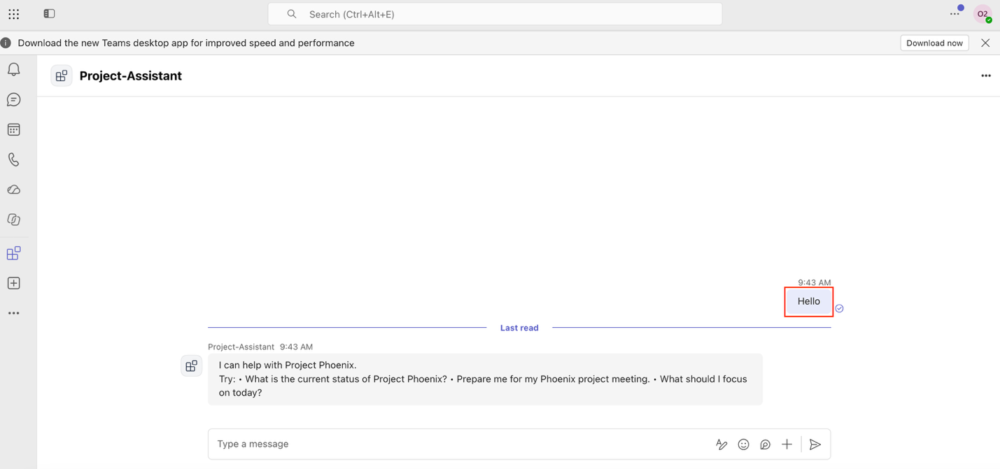

    

2.  To prepare for the project meeting, enter the following prompt:

    +++Prepare me for my Phoenix project meeting.+++

    

3.  To generate the project update card, enter the following prompt:

    +++ Draft a project update.+++

    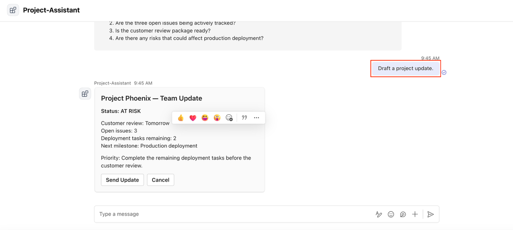

4.  Click the **Send Update** button to test the card actions. The
    assistant returns a confirmation that the project update was sent
    successfully.

    

    

## Summary

In this lab, you built and deployed a **Zava Project Status Assistant**
using the **Microsoft Teams SDK for Python**. You created a Teams
application that provides Project Phoenix status, priorities, and
meeting-preparation information, then enhanced it with an **Adaptive
Card** that enables users to take action on a project update. You tested
the application locally, exposed it through a **Microsoft Dev Tunnel**,
and registered and installed it in **Microsoft Teams** using the Teams
Developer CLI. Finally, you completed an end-to-end test in Teams to
verify that the assistant can respond to project-related requests and
process Adaptive Card actions.
